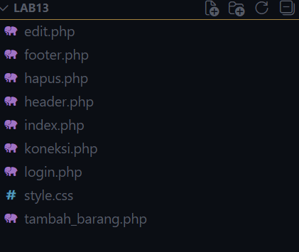
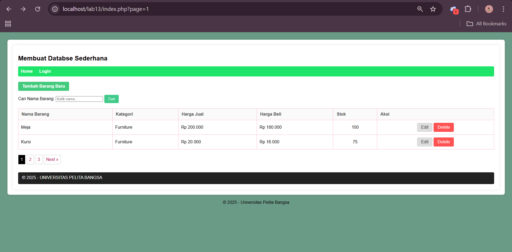
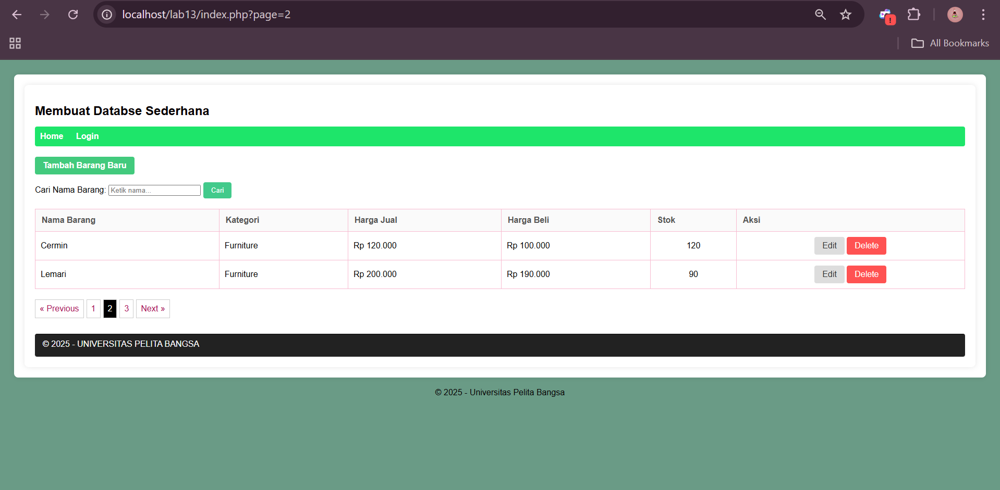
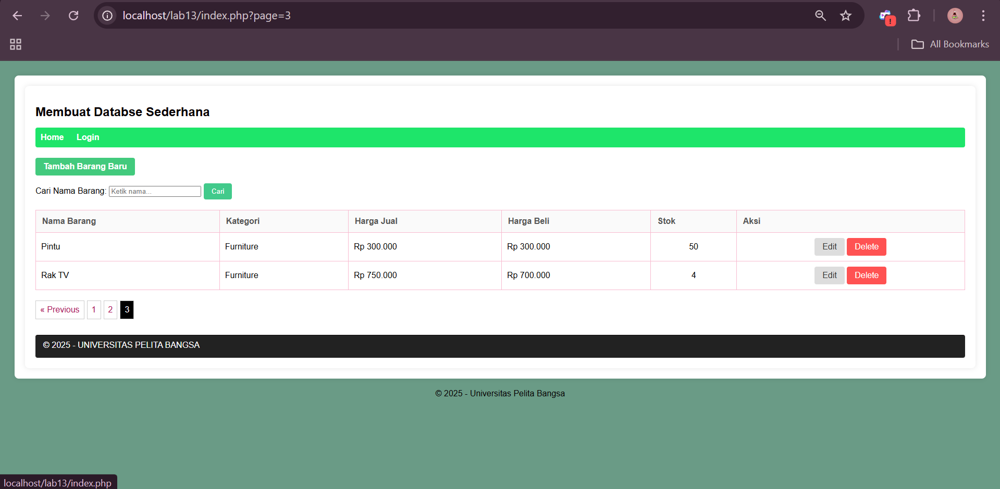
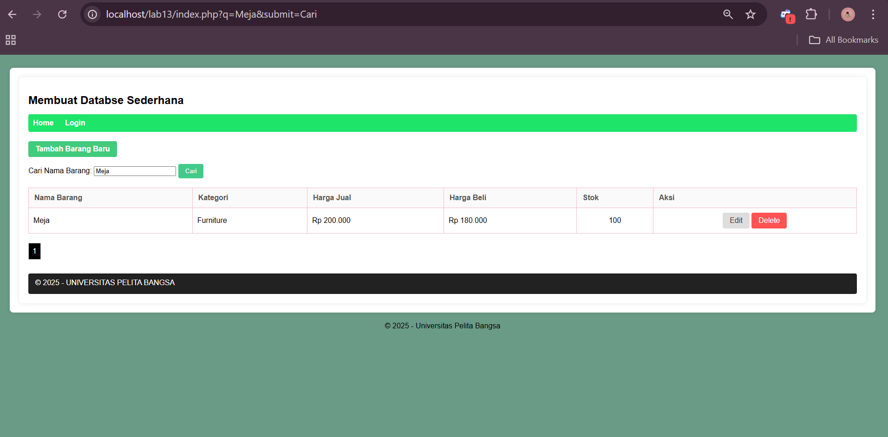
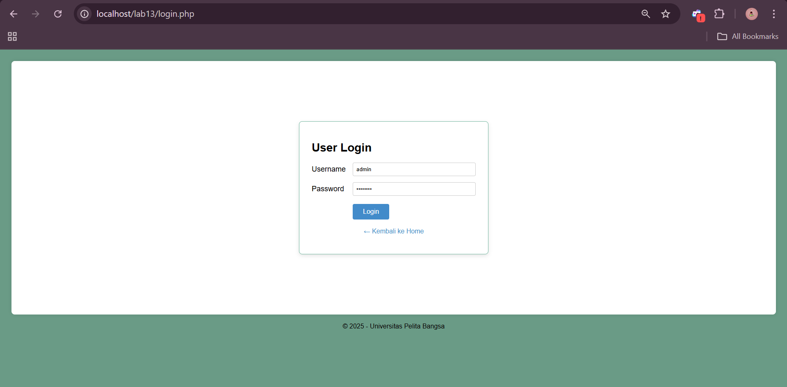
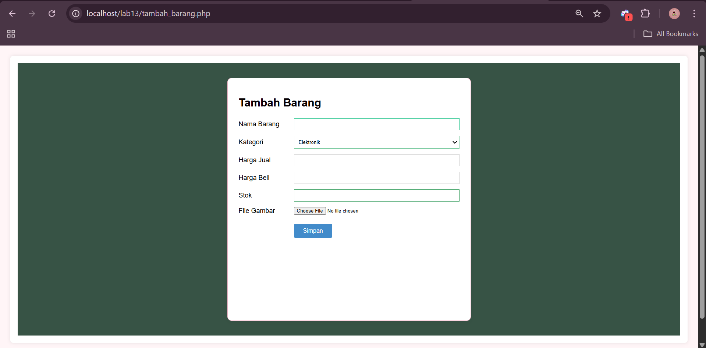

# lab13 
```
Nama  : M. Rizqy Al Rasyd
Nim   : 312410424
Kelas : TI.24.A3
```

```
Pada kali ini kita akan membuat pagination, yang pada intinya pagination
ini berfungsi sebagai pembagi yang ditampilkan pada halaman web.
```
## Struktur Code


## Pagination
Code index.php:
```
<?php
include_once 'koneksi.php';

$q = "";
$sql_where = "";
if (isset($_GET['submit']) && !empty($_GET['q'])) {
    $q = $_GET['q'];
    $sql_where = " WHERE nama LIKE '%{$q}%'";
 
}

$sql_count = "SELECT COUNT(*) FROM data_barang" . $sql_where;
$result_count = mysqli_query($conn, $sql_count);
$r_data = mysqli_fetch_row($result_count);
$count = $r_data[0];

$per_page = 2;
$num_page = ceil($count / $per_page);
$page = isset($_GET['page']) ? $_GET['page'] : 1;
$offset = ($page - 1) * $per_page;

$sql = "SELECT * FROM data_barang" . $sql_where . " LIMIT {$offset}, {$per_page}";
$result = mysqli_query($conn, $sql);

$title = 'Daftar Barang';
include_once 'header.php'; 
?>

<div class="container">
    <h1>Membuat Databse Sederhana</h1>

    <div class="nav-blue">
        <a href="index.php">Home</a>
        <a href="login.php">Login</a>
    </div>

    <a href="tambah_barang.php" class="btn btn-tambah">Tambah Barang Baru</a>

    <form action="" method="get" style="margin-bottom: 20px;">
        <label>Cari Nama Barang: </label>
        <input type="text" name="q" class="input-q" value="<?php echo $q ?>" placeholder="Ketik nama...">
        <input type="submit" name="submit" value="Cari" class="btn btn-cari">
    </form>

    <table border="1" cellpadding="10" cellspacing="0" style="width: 100%; border-collapse: collapse;">
        <thead>
            <tr style="background-color: #010000ff; color: white;">
                <th>Nama Barang</th>
                <th>Kategori</th>
                <th>Harga Jual</th>
                <th>Harga Beli</th>
                <th>Stok</th>
                <th>Aksi</th>
            </tr>
        </thead>
        <tbody>
            <?php if($result && mysqli_num_rows($result) > 0): ?>
                <?php while($row = mysqli_fetch_array($result)): ?>
                <tr>
                    <td><?php echo $row['nama']; ?></td>
                    <td><?php echo $row['kategori']; ?></td>
                    <td>Rp <?php echo number_format($row['harga_jual'], 0, ',', '.'); ?></td>
                    <td>Rp <?php echo number_format($row['harga_beli'], 0, ',', '.'); ?></td>
                    <td style="text-align: center;"><?php echo $row['stok']; ?></td>
                    <td style="text-align: center;">
                        <a href="edit.php?id=<?php echo $row['id']; ?>" class="btn btn-edit">Edit</a>
                        <a href="hapus.php?id=<?php echo $row['id']; ?>" class="btn btn-delete" onclick="return confirm('Yakin ingin menghapus barang ini?')">Delete</a>
                    </td>
                </tr>
                <?php endwhile; ?>
            <?php else: ?>
                <tr>
                    <td colspan="6" style="text-align: center; padding: 20px;">Data tidak ditemukan atau masih kosong.</td>
                </tr>
            <?php endif; ?>
        </tbody>
    </table>

    <ul class="pagination" style="margin-top: 20px; list-style: none; display: flex;">

    <?php if ($page > 1): 
        $prev = $page - 1;
        $link_prev = "?page={$prev}";
        if (!empty($q)) $link_prev .= "&q={$q}&submit=Cari";
    ?>
        <li>
            <a href="<?php echo $link_prev; ?>"
               style="padding:8px; text-decoration:none; border:1px solid #ccc; margin-right:5px;">
               &laquo; Previous
            </a>
        </li>
    <?php endif; ?>

    <?php for ($i = 1; $i <= $num_page; $i++): 
        $link = "?page={$i}";
        if (!empty($q)) $link .= "&q={$q}&submit=Cari";
        $active = ($page == $i) ? "background-color:#000; color:white;" : "";
    ?>
        <li>
            <a href="<?php echo $link; ?>"
               style="padding:8px; text-decoration:none; border:1px solid #ccc; margin-right:5px; <?php echo $active; ?>">
               <?php echo $i; ?>
            </a>
        </li>
    <?php endfor; ?>

    <?php if ($page < $num_page): 
        $next = $page + 1;
        $link_next = "?page={$next}";
        if (!empty($q)) $link_next .= "&q={$q}&submit=Cari";
    ?>
        <li>
            <a href="<?php echo $link_next; ?>"
               style="padding:8px; text-decoration:none; border:1px solid #ccc;">
               Next &raquo;
            </a>
        </li>
    <?php endif; ?>

    </ul>

    <footer style="margin-top: 30px; border-top: 1px solid #020000ff; padding-top: 10px;">
        &copy; 2025 - UNIVERSITAS PELITA BANGSA
    </footer>
</div>

<?php include_once 'footer.php'; ?>
```



Nah disini kan terbagi menjadi 3 halamana karena menggunakan pagination.


Lalu di index juga kita bisa mencari barang karna sudah ditambahkan fungsi yang terhubung dengan pagination.

## Login
Code:
```
<?php
session_start();
if (isset($_POST['submit'])) {
    // Validasi sederhana
    if ($_POST['username'] == 'admin' && $_POST['password'] == 'admin123') {
        $_SESSION['login'] = true;
        header('location: index.php');
        exit;
    } else {
        $error = "Username atau Password salah!";
    }
}
$title = 'Login';
include_once 'header.php';
?>

<div style="display: flex; justify-content: center; align-items: center; min-height: 70vh;">
    
    <div style="width: 100%; max-width: 400px; padding: 30px; background: #fff; border-radius: 8px; box-shadow: 0 4px 10px rgba(0,0,0,0.1); border: 1px solid #73b69fff;">
        
        <h1 style="color: #000; margin-bottom: 20px; font-size: 28px;">User Login</h1>
        
        <?php if(isset($error)): ?>
            <p style="color: red; margin-bottom: 15px;"><?php echo $error; ?></p>
        <?php endif; ?>

        <form method="post">
            <div style="margin-bottom: 15px; display: flex; align-items: center;">
                <label style="width: 100px; font-size: 18px;">Username</label>
                <input type="text" name="username" style="flex: 1; padding: 8px; border: 1px solid #ccc; border-radius: 4px;" value="admin">
            </div>
            
            <div style="margin-bottom: 20px; display: flex; align-items: center;">
                <label style="width: 100px; font-size: 18px;">Password</label>
                <input type="password" name="password" style="flex: 1; padding: 8px; border: 1px solid #ccc; border-radius: 4px;" value="admin123">
            </div>
            
            <div style="margin-left: 100px;">
                <input type="submit" name="submit" value="Login" class="btn" style="background-color: #428bca; color: white; padding: 10px 25px; border: none; border-radius: 4px; cursor: pointer; font-size: 16px;">
            </div>
        </form>
        
        <p style="margin-top: 20px; text-align: center;">
            <a href="index.php" style="color: #4291caff; text-decoration: none;">&larr; Kembali ke Home</a>
        </p>
    </div>
</div>

<?php include_once 'footer.php'; ?>
```


## Tambah
Code:
```
<?php
include_once 'koneksi.php';

if (isset($_POST['submit'])) {
    $nama = $_POST['nama'];
    $kategori = $_POST['kategori'];
    $harga_jual = $_POST['harga_jual'];
    $harga_beli = $_POST['harga_beli'];
    $stok = $_POST['stok'];
    
    // Proses Upload Gambar
    $gambar = $_FILES['file_gambar']['name'];
    $tmp = $_FILES['file_gambar']['tmp_name'];
    move_uploaded_file($tmp, "gambar/" . $gambar);

    $sql = "INSERT INTO data_barang (nama, kategori, harga_jual, harga_beli, stok, gambar) 
            VALUES ('$nama', '$kategori', '$harga_jual', '$harga_beli', '$stok', '$gambar')";
    
    if (mysqli_query($conn, $sql)) {
        header('Location: index.php');
        exit;
    } else {
        echo "Gagal Simpan: " . mysqli_error($conn);
    }
}
$title = 'Tambah Barang';
include_once 'header.php';
?>

<div style="display: flex; justify-content: center; padding: 40px; background-color: #375345ff; min-height: 80vh;">
    <div style="width: 100%; max-width: 600px; padding: 30px; background: white; border-radius: 12px; border: 1px solid #f8bbd0; box-shadow: 0 4px 15px rgba(0,0,0,0.05);">
        
        <h1 style="margin-bottom: 25px; font-size: 30px;">Tambah Barang</h1>
        
        <form method="post" enctype="multipart/form-data">
            <div style="margin-bottom: 15px; display: flex; align-items: center;">
                <label style="width: 150px; font-size: 18px;">Nama Barang</label>
                <input type="text" name="nama" style="flex: 1; padding: 8px; border: 1px solid #0dbe80ff;" required>
            </div>
            <div style="margin-bottom: 15px; display: flex; align-items: center;">
                <label style="width: 150px; font-size: 18px;">Kategori</label>
                <select name="kategori" style="flex: 1; padding: 8px; border: 1px solid #7dcba2ff;">
                    <option value="Elektronik">Elektronik</option>
                    <option value="Furniture">Furniture</option>
                </select>
            </div>
            <div style="margin-bottom: 15px; display: flex; align-items: center;">
                <label style="width: 150px; font-size: 18px;">Harga Jual</label>
                <input type="number" name="harga_jual" style="flex: 1; padding: 8px; border: 1px solid #ccc;">
            </div>
            <div style="margin-bottom: 15px; display: flex; align-items: center;">
                <label style="width: 150px; font-size: 18px;">Harga Beli</label>
                <input type="number" name="harga_beli" style="flex: 1; padding: 8px; border: 1px solid #ccc;">
            </div>
            <div style="margin-bottom: 15px; display: flex; align-items: center;">
                <label style="width: 150px; font-size: 18px;">Stok</label>
                <input type="number" name="stok" style="flex: 1; padding: 8px; border: 1px solid #198f46ff;">
            </div>
            <div style="margin-bottom: 25px; display: flex; align-items: center;">
                <label style="width: 150px; font-size: 18px;">File Gambar</label>
                <input type="file" name="file_gambar" style="flex: 1;">
            </div>
            
            <div style="margin-left: 150px;">
                <input type="submit" name="submit" value="Simpan" style="background-color: #428bca; color: white; padding: 10px 25px; border: none; border-radius: 4px; cursor: pointer; font-size: 16px;">
            </div>
        </form>
    </div>
</div>

<?php include_once 'footer.php'; ?>
```



